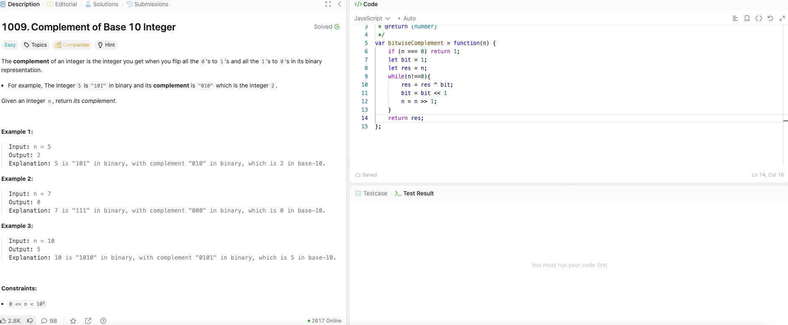

---

## 🧠 Meta

- **Problem ID:** 1009
- **Difficulty:** Easy
- **Category:** Bit
- **Date Solved:** 2026-03-1
- **Time Spent:** ~13 minutes
- **Solved By Myself:** ⚠️ partial
- **Revisit Needed:** Yes

---

## 🚧 Where I Got Stuck

- What confused me?
- What wrong approach did I try first?
- What assumption was incorrect?

---

## 💡 Key Insight

- Use XOR and number 1 as mask.
- Dont need to change the number to binary string. Just operate on the number it self.
- Remember we can also left shift the 1 mask using 1<<1 as we want to flip bits of n further in the left
