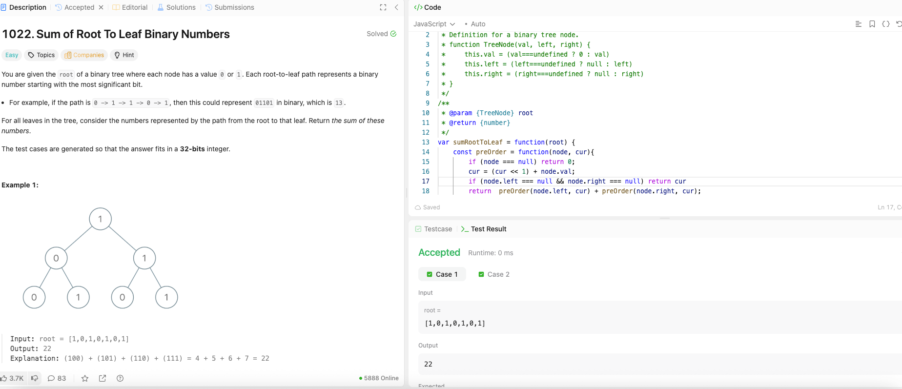

---

## 🧠 Meta

- **Problem ID:** 1022
- **Difficulty:** Easy
- **Category:** Binary / Tree
- **Date Solved:** 2026-02-24
- **Time Spent:** ~18 minutes
- **Solved By Myself:** ✅
- **Revisit Needed:** Yes

---

## 🚧 Where I Got Stuck

- What confused me?
- What wrong approach did I try first?
- What assumption was incorrect?

---

## 💡 Key Insight

I used back tracking and midOrder transversal to get the binary strings and converted them to numbers to be summed

- it can be solved by carrying the bit with the transversal using << and pre order transversal. Need to pay attention to how each level return value tho
