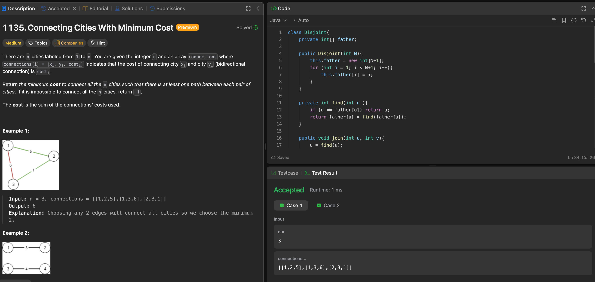

# LeetCode 1135. Connecting Cities With Minimum Cost

---

## 🧠 Meta

- **Problem ID:** 1135
- **Difficulty:** Medium
- **Category:** Graph / Disjoint set /Kruskal
- **Date Solved:** 2026-02-03
- **Time Spent:** ~XX minutes
- **Solved By Myself:** ⚠️ partial
- **Revisit Needed:** Yes

---

## 🚧 Where I Got Stuck

- What confused me?
- What wrong approach did I try first? I tried prim algorithm but that gave my TLE because it's O(v^2)
- What assumption was incorrect? it's not using minDist like dijkstra because it's not the distance to a single source.

---

## 💡 Key Insight

Use kruskal, which operate on edges instead of prim operating on vertices. The way we check if a edge is connecting a node already in the minimal tree to another node in the tree is to use Disjoint set. checking if all the nodes are connected can be done by counting the edges of the minimal tree. it should be n-1 edges to connect n nodes
