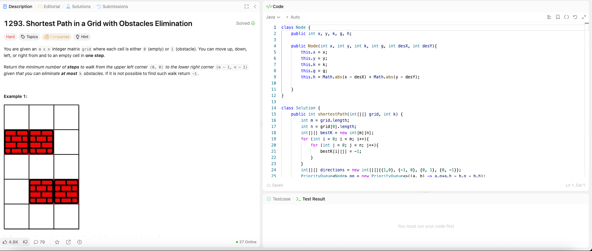

---

## 🧠 Meta

- **Problem ID:** 1293
- **Difficulty:** Hard
- **Category:** Graph / A\* algorithm
- **Date Solved:** 2026-02-05
- **Time Spent:** ~XX minutes
- **Solved By Myself:** ❌
- **Revisit Needed:** Yes

---

## 🚧 Where I Got Stuck

- What confused me? OOP, the state transition needs to include k to, and the activation function is needed for A\* to do a faster BFS
- What wrong approach did I try first?
- What assumption was incorrect?

---

## 💡 Key Insight

Using A\* for a quicker search. the use of bestK to replace the visited array is genius. I need to construct the object Node to include x, y, k, which is the remaining chance to eliminate an obstacle, and also I need to keep track of g, the distance to start, and h, the distance to destination.

- The interesting part of A\* is that we don't know the actual distance to the destination when we define h, so we use manhattan distance instead, sometimes we can choose euclidean distance too.

- The queue used by simple BFS is replaced by PriorityQueue sorted on g+f. An elegant algorithm
