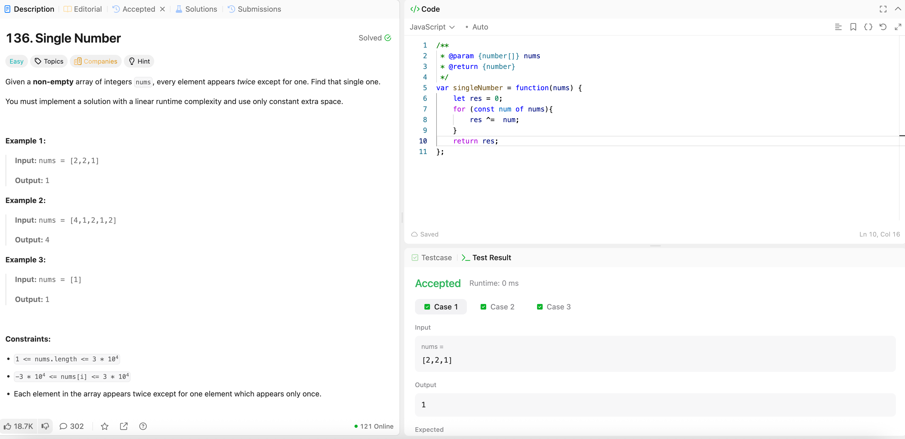

---

## 🧠 Meta

- **Problem ID:** 136
- **Difficulty:** Easy
- **Category:** Bitwise operator
- **Date Solved:** 2026-02-26
- **Time Spent:** ~19 minutes
- **Solved By Myself:** ❌
- **Revisit Needed:** Yes

---

## 🚧 Where I Got Stuck

- What confused me? Solving in constant space is hard
- What wrong approach did I try first?
- What assumption was incorrect?

---

## 💡 Key Insight

To solve in constant space. No map or set is allowed.

- Use XOR (exclusive or) bitwise operator, where a ^a = 0 and 0 ^ b = b
- XOR can be thinking of bit addition without carry. So on bitwise, 1 ^ 1 = 0 ^ 0 = 0, and 1 ^ 0 = 1;
