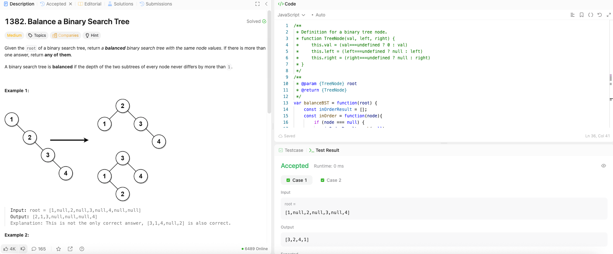

---

## 🧠 Meta

- **Problem ID:** 1382
- **Difficulty:** Medium
- **Category:** Tree / Array
- **Date Solved:** 2026-02-09
- **Time Spent:** ~25 minutes
- **Solved By Myself:** ⚠️ partial
- **Revisit Needed:** Yes / No

---

## 🚧 Where I Got Stuck

- What confused me? Being thinking about the problem tha asks for different ways of balancing a binary tree
- What wrong approach did I try first? I thought of bfs array representation of the tree, and found it irrelevant
- What assumption was incorrect?

---

## 💡 Key Insight

I looked at the hints and knew: use in order traversal, so we can pick the mid and do recursion on both sides of the mid
