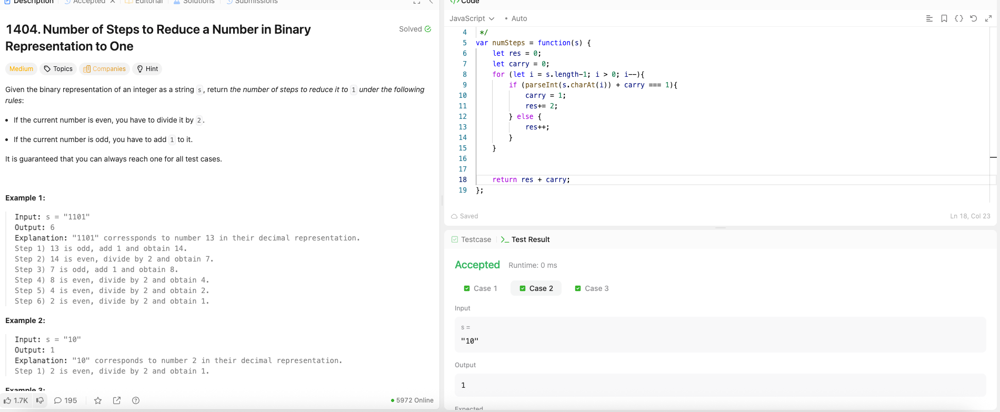

---

## 🧠 Meta

- **Problem ID:** 1404
- **Difficulty:** Medium
- **Category:** Bit operation
- **Date Solved:** 2026-02-26
- **Time Spent:** ~12 minutes
- **Solved By Myself:** ✅
- **Revisit Needed:** Yes / No

---

## 🚧 Where I Got Stuck

- What confused me?
- What wrong approach did I try first? I use parseInt to transfer binary string to number and the number is too big. Should use BigInt('0b' + num) and num >> 1n instead of num/2
- What assumption was incorrect?

---

## 💡 Key Insight

- The method I first used passed, it's a simulation method but it's slow
- The method with carry, and scanning the binary string instead is quicker. when carry + current digit is 1, it means 2 more step to put it to 0 and remove it. And the carry will be 1. If carry + current digit is 0 or 2, which is in the else block, the carry remains unchanged, and we only need to remove this digit so that's 1 more step
- Be careful when scanning. Want to stop before the first digit, because that's when it's possible it's the 1 we want. But if the carry at that time is 1, that mean we have 10, and need to do one more removal. So the final result should be res + carry
