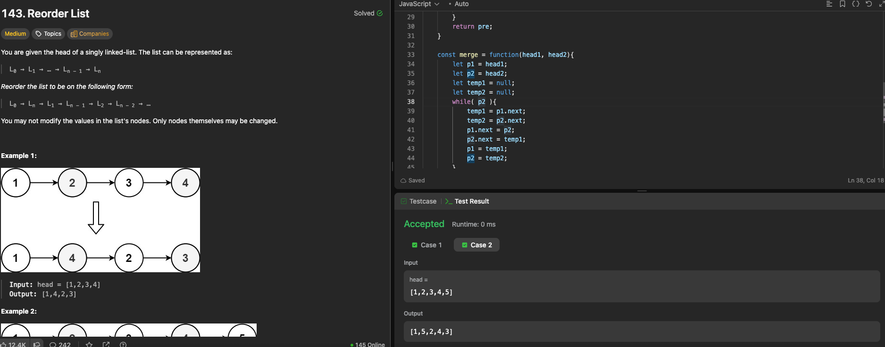

---

## 🧠 Meta

- **Problem ID:** 143
- **Difficulty:** Medium
- **Category:** LinkedList
- **Date Solved:** YYYY-MM-DD
- **Time Spent:** ~50 minutes
- **Solved By Myself:** ❌
- **Revisit Needed:** Yes

---

## 🚧 Where I Got Stuck

- What confused me?
- What wrong approach did I try first? I thought of using two pointers one at the end one at the head, but it doesn't work that way
- What assumption was incorrect?

---

## 💡 Key Insight

- This problem should be solved in three steps: 1. find the middle of the list. 2. Reverse the second half. 3. Merge the first half and the second half one by one.
- The most difficult part is coming up with the idea of reverse the second part and then merge them. I was stuck with one method to operate on a node by node level.
- Should be careful when merging the two lists. Because the first element is also from the first list, so we want the first list to be longer if the total number of node is odd. Then we can do while(pointer1){ ....} and let pointer1 go next.
