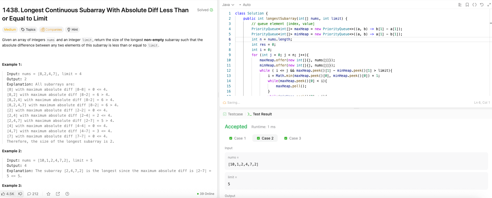

---

## 🧠 Meta

- **Problem ID:** 1438
- **Difficulty:** Medium
- **Category:** Two Pointers / Sliding window / MinHeap, MaxHeap
- **Date Solved:** 2026-04-03
- **Time Spent:** ~68 minutes
- **Solved By Myself:** ❌
- **Revisit Needed:** Yes

---

## 🚧 Where I Got Stuck

- What confused me? I knew it's a sliding window problem, but i got stuck at updating the min and max of current window after shrinking
- What wrong approach did I try first? thought of monotonic stack and maybe prefix table but no
- What assumption was incorrect?

---

## 💡 Key Insight

- Use minHeap and maxHeap to store arrays of the form [index, value] therefore peek can give us current max and min in constant time.
- When shrinking, let the left boundary be the min of (min index, max index) + 1. keep shrinking until the window is valid. After each shrinking we also need to remove the outdated min and max from minHeap and maxHeap by removing the top of each heap until the top has index greater than or equal to left.
  We only remove the top because these are the one that matters. We only use top to check if the window is valid.
