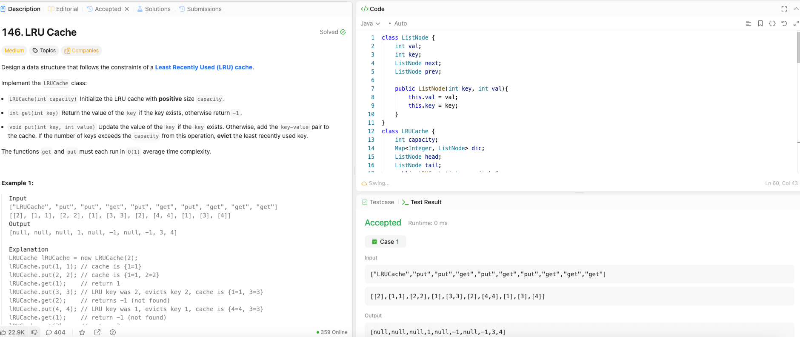

---

## 🧠 Meta

- **Problem ID:** 146
- **Difficulty:** Medium
- **Category:** HashMap / Queue / Double linked list
- **Date Solved:** 2026-02-14
- **Time Spent:** 49 minutes
- **Solved By Myself:** ❌
- **Revisit Needed:** Yes

---

## 🚧 Where I Got Stuck

- What confused me?
- What wrong approach did I try first? I thought of using a priority queue based on the access number, but it won't get the const time, and get method would be a big trouble.
- What assumption was incorrect?

---

## 💡 Key Insight

- choosing the right data structures is the key. Use HashMap, and double linked list. Using the double linked list as a queue, so we know which key-value pair to delete first. We choose double linked list because it can add and delete on constant time once we have the reference to the target node
- to get O(1) for getting the target node, let the hashmap be of (key, node) pairs. and the double linked nodes should have both key and value. value itself is no enough. The reason is, once a node is removed from the linked list, ie. a (key, node) pair is removed from the hashMap, we need to remove the (key, node) pair from the map too using map.remove(node.key)
- creating helper functions for adding and removing a node is helpful
- I followed the solution for this questions. My take away is: First specify the requirement of the implementation, then decide data structure, then finish the interface. Helper functions are useful for interface functions.
