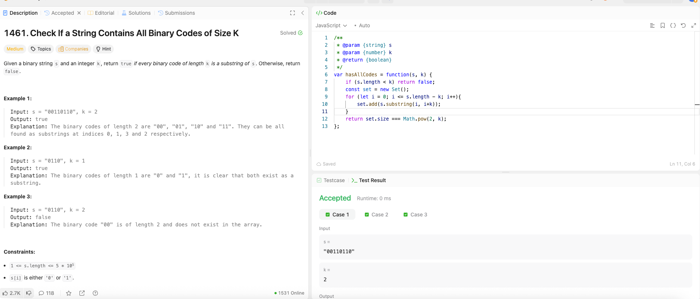

---

## 🧠 Meta

- **Problem ID:** 1461
- **Difficulty:** Medium
- **Category:** Set / Binary
- **Date Solved:** 2026-02-23
- **Time Spent:** 12 minutes
- **Solved By Myself:** ⚠️ partial
- **Revisit Needed:** Yes

---

## 🚧 Where I Got Stuck

- What confused me?
- What wrong approach did I try first?
- What assumption was incorrect?

---

## 💡 Key Insight

Looked at the hint and solved this. The number of possible binary string of length k is 2^k, so check the number of k-length distinct substring of s is enough

- js set size is checked with set.size
