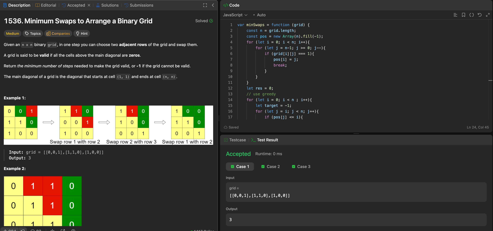

---

## 🧠 Meta

- **Problem ID:** 1536
- **Difficulty:** Medium
- **Category:** Greedy
- **Date Solved:** 2026-03-03
- **Time Spent:** ~42 minutes
- **Solved By Myself:** ❌
- **Revisit Needed:** Yes

---

## 🚧 Where I Got Stuck

- What confused me? I knew I need to ranked base on the last position of 1, but the swapping part left me clueless. I was afraid of and clueless about tracking the constant shifting rows.
- What wrong approach did I try first?
- What assumption was incorrect?

---

## 💡 Key Insight

- Use greedy method, to achieve minimum number of swap, also choose the closest candidate. And we construct the grid from up to down.
- Greedy is correct we are only sweeping the below the row we are currently at. And the lower they go, the more forgiving they are.
  The closest candidate make sure we have the fewest swaps
- keep the target candidate row and do the swapping on the precomputed pos array, and do swapping manually, bubbling up
