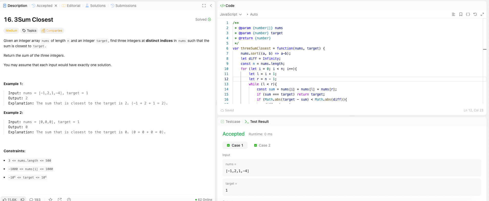

---

## 🧠 Meta

- **Problem ID:** 16
- **Difficulty:** Medium
- **Category:** Two Pointers
- **Date Solved:** 2026-03-09
- **Time Spent:** ~20 minutes
- **Solved By Myself:** ❌
- **Revisit Needed:** Yes

---

## 🚧 Where I Got Stuck

- What confused me?
- What wrong approach did I try first?
- What assumption was incorrect?

---

## 💡 Key Insight

The two pointers method for 3 sum is to do one for loop for the first candidate, and make second candidate i+1, and the last candidate the last element. Adjust the current minimum diff as necessary O(n^2)

- Remember to sort the array first before using two pointers
- could also use binary search: fix two numbers i.e two for loop, then binary search on the third number O(n^2logn)
