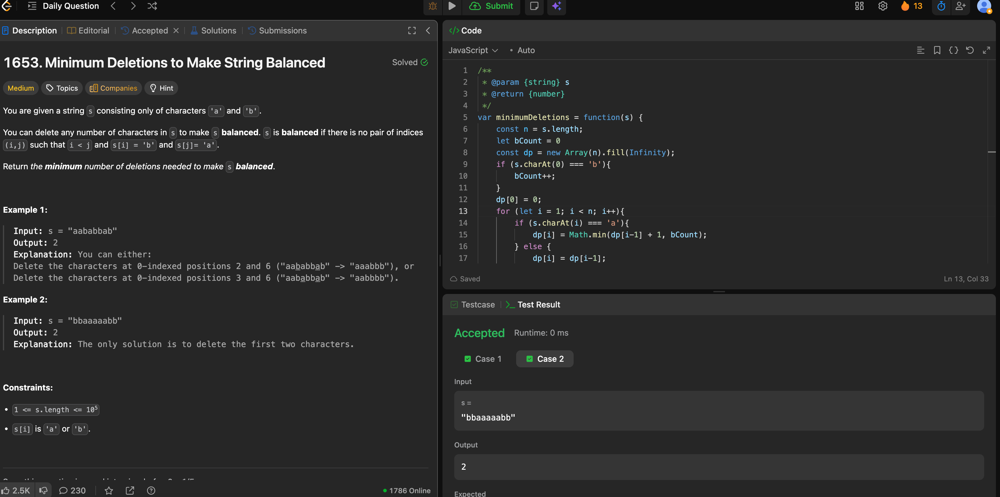

---

## 🧠 Meta

- **Problem ID:** 1653
- **Difficulty:** Medium
- **Category:** DP
- **Date Solved:** 2026-02-07
- **Time Spent:** ~XX minutes
- **Solved By Myself:** ❌
- **Revisit Needed:** Yes

---

## 🚧 Where I Got Stuck

- What confused me? I thought of DP, but I thought handling dp[i] can be very difficult, because I don't know if s[i-1] is deleted or kept. But it doesn't matter at the end
- What wrong approach did I try first?
- What assumption was incorrect?

---

## 💡 Key Insight

I got the dp definition right. dp[i] is the min number of deletion needed to keep balance. The key insight is that when current char is b, you don't need to delete it because the substring before it either ends as a or b, but either way it's valid. It's only when current char is a, you need to decide keep it or not. if keep it, that means no b in front, so we delete the b count. If delete it, we have dp[i-1] + 1 and here again we don't care if the previous substring ends with a or b, we know it's valid, and we know with current char being deleted, the previous substring is still valid.
