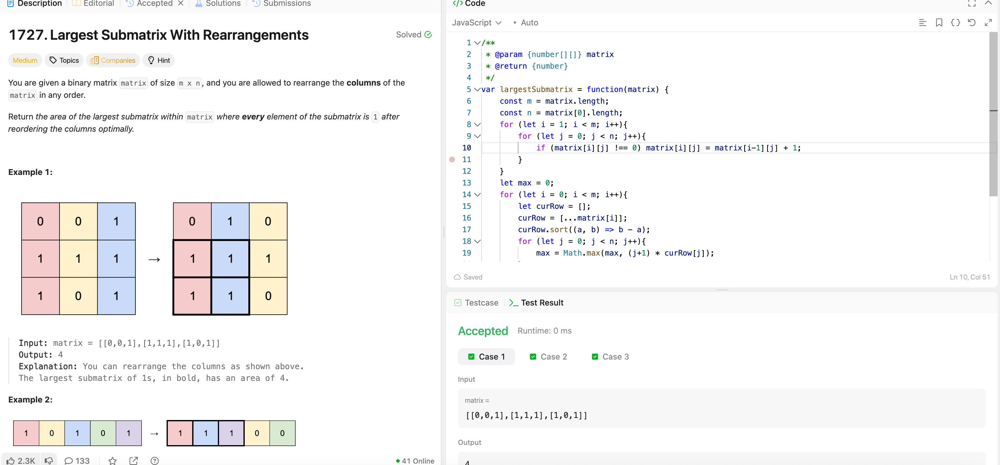

---

## 🧠 Meta

- **Problem ID:** 1727
- **Difficulty:** Medium
- **Category:** Array / DP
- **Date Solved:** 2026-04-01
- **Time Spent:** ~80 minutes
- **Solved By Myself:** ❌
- **Revisit Needed:** Yes

---

## 🚧 Where I Got Stuck

- What confused me? Thought of DP but in a very general 2D DP table and stuck with transform function. Thought if need some transform from both left and up direction
- What wrong approach did I try first?
- What assumption was incorrect?

---

## 💡 Key Insight

- transform the matrix's value. change the value to the number of consecutive 1s up to this current row inclusively, for each column.
- sort the current cow, we can do it in descending order, so everything on the left can match the height of the current column.
- take the max along the way to get the result.
