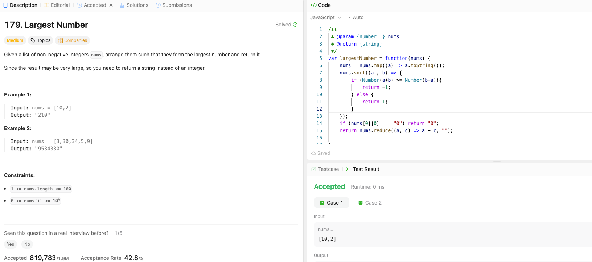

---

## 🧠 Meta

- **Problem ID:** 179
- **Difficulty:** Medium
- **Category:** Sort / String
- **Date Solved:** 2026-04-12
- **Time Spent:** ~XX minutes
- **Solved By Myself:** ⚠️ partial
- **Revisit Needed:** Yes

---

## 🚧 Where I Got Stuck

- What confused me?
- What wrong approach did I try first? I turn them to string and sort them lexicologically and tried to append them
- What assumption was incorrect? sort on lexical is not enough , for example 3 and 31 will give 313 which is not bigger than 331

---

## 💡 Key Insight

- The most intuitive way is to just compare String(a) + String(b) and String(b) + String(a). java use Integer.toString(), compare them with c.compareTo(d) for string c and d
- Need to check if the first string is "0" for the all 0 case
