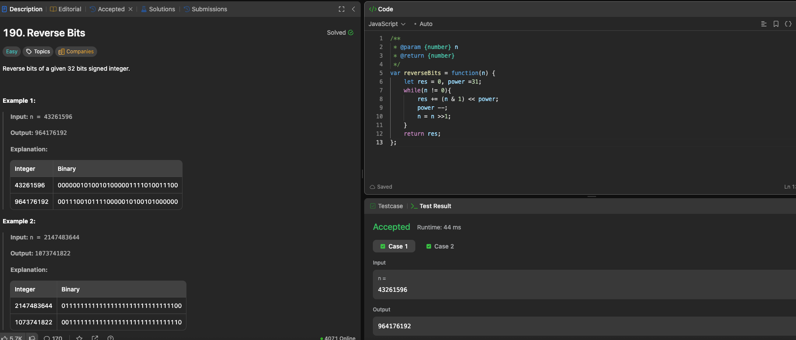

---

## 🧠 Meta

- **Problem ID:** 190
- **Difficulty:** Easy
- **Category:** Bit operation
- **Date Solved:** 2026-02-16
- **Time Spent:** ~XX minutes
- **Solved By Myself:** ❌
- **Revisit Needed:** Yes

---

## 🚧 Where I Got Stuck

- What confused me?
- What wrong approach did I try first?
- What assumption was incorrect?

---

## 💡 Key Insight

Need to refresh my memory on bit operations
