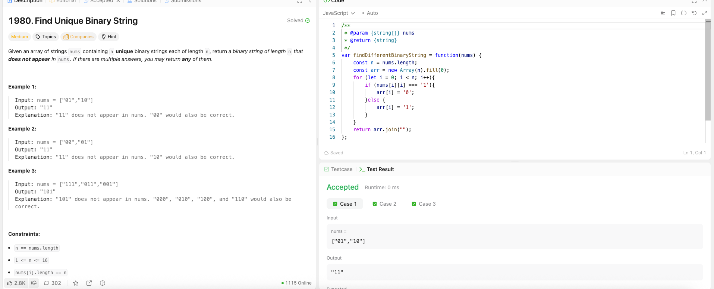

---

## 🧠 Meta

- **Problem ID:** 1980
- **Difficulty:** Medium
- **Category:** Array
- **Date Solved:** 2026-03-09
- **Time Spent:** ~20 minutes
- **Solved By Myself:** ❌
- **Revisit Needed:** Yes

---

## 🚧 Where I Got Stuck

- What confused me?
- What wrong approach did I try first? I thought of backtracking and using a set to check for existence. But figured there gotta be a more efficient way
- What assumption was incorrect?

---

## 💡 Key Insight

- The efficient way is to make the result string differ from strings in array by just one char. Namely differs from array[i] at the ith char.
