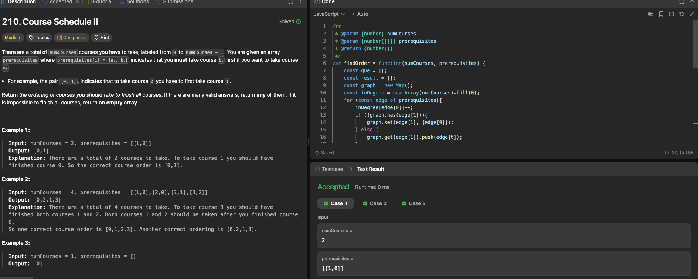

# LeetCode 210. Course Schedule II

---

## 🧠 Meta

- **Problem ID:** 210
- **Difficulty:** Medium
- **Category:** Graph / Topological sorting / cycle detecting
- **Date Solved:** 2026-02-03
- **Time Spent:** ~XX minutes
- **Solved By Myself:** ⚠️ partial
- **Revisit Needed:** Yes

---

## 🚧 Where I Got Stuck

- What confused me? I forgot what to do with topological sorting
- What wrong approach did I try first?
- What assumption was incorrect?

---

## 💡 Key Insight

Need to be familiar with topological sorting. Coding is not hard. The idea is to find the node with in degree equal to 0 and push it to a que.

- first we compute the graph, using a map to show u connect to a list of v(s), and store each node's in degree in a map
- loop through nodes, if in degree is 0, push it to que
- shift from the que,which is a node of 0 in degree, push it to result array, and loop through the nodes this node connect to using graph. reduce the in degree of those nodes by 1; If those nodes have 0 in degree, unshift to que for later handling
- if result's length is n. then we good. otherwise there's a cycle in the graph.
