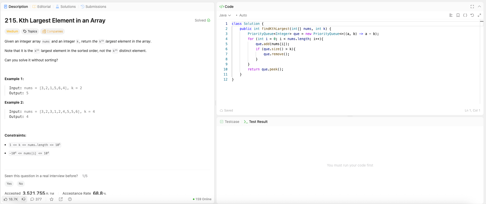

---

## 🧠 Meta

- **Problem ID:** 215
- **Difficulty:** Medium
- **Category:** Sort / Heap / PriorityQueue / Quick Select / count sort
- **Date Solved:** 2026-03-10
- **Time Spent:** ~19 minutes
- **Solved By Myself:** ❌
- **Revisit Needed:** Yes

---

## 🚧 Where I Got Stuck

- What confused me?
- What wrong approach did I try first? I thought of something close to quick select, but i am only counting number of occurrence that is greater than current number
- What assumption was incorrect?

---

## 💡 Key Insight

- First we can use minHeap. it's not sorting and only O(nlogk)
- Then I learnt about quick select, which is mathematically usually mostly on average O(n)
- Then there's also count sort. It's not a sort restricted by the problem because it doesn't use comparison. Just count the frequency and record it to an array, and iteration from the largest index, until we reach the kth greatest element. Be careful about offset when the value can be negative.
