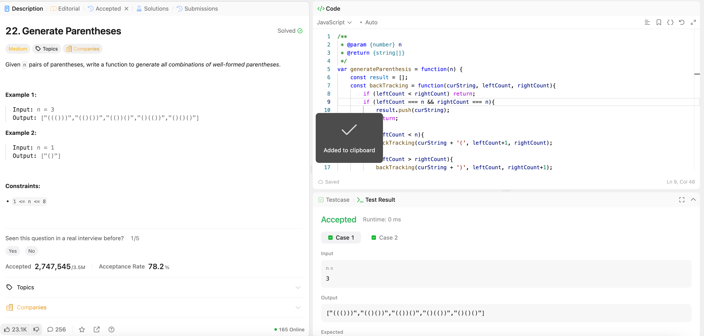

---

## 🧠 Meta

- **Problem ID:** 22
- **Difficulty:** Medium
- **Category:** BackTracking
- **Date Solved:** 2026-02-06
- **Time Spent:** ~XX minutes
- **Solved By Myself:** ❌
- **Revisit Needed:** Yes

---

## 🚧 Where I Got Stuck

- What confused me? I thought it's something to do with tree and recursion and then I get stuck
- What wrong approach did I try first?
- What assumption was incorrect?

---

## 💡 Key Insight

It's backTracking! Once you know it's backtracking it's easy. But there's also a trick to verify if a string is valid. I need to find the relationship of left parentheses count and right parentheses count, to determine what's the next step in string addition.

- key conditions: left < n and left > right
