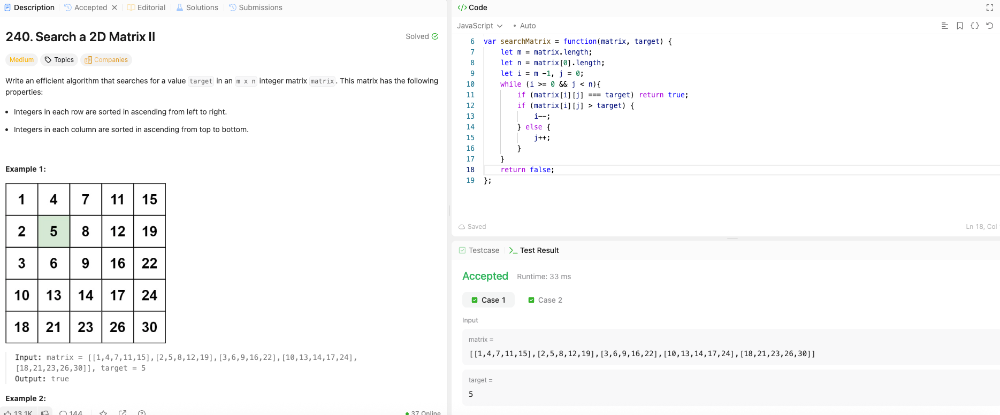

---

## 🧠 Meta

- **Problem ID:** 240
- **Difficulty:** Medium
- **Category:** Matrix / Divide and conquer / binary search
- **Date Solved:** 2026-04-13
- **Time Spent:** ~44 minutes
- **Solved By Myself:** ❌
- **Revisit Needed:** Yes

---

## 🚧 Where I Got Stuck

- What confused me?
- What wrong approach did I try first? I thought of binary search in a recursive function calling way, take turning doing binary search on vertical and horizontal way as the search space shrinks, but can't put it into code.
- What assumption was incorrect?

---

## 💡 Key Insight

The one idea or mental model that unlocked the solution.

- if doing binary search, it will be doing iteration on diagonal, do vertical and horizontal binary search on each iteration which is O(nlogn)
- Divide and conquer shrink the search space but dividing it to four spaces. do the binary on horizontal, and then find the delimiter row such that matrix[row-1][mid]<target < matrix[row][mid] and keep calling the recursive function. But this is not very intuitive
- Most intuitive way is doing the zigzag pruning as shown in the picture. Start from the bottom left, move up if it's greater than target and right if smaller.
  it won't miss the target because when moving up everything to the current right is also bigger. and when moving right everything to the top is already smaller. move until the pointer go out of the board.
