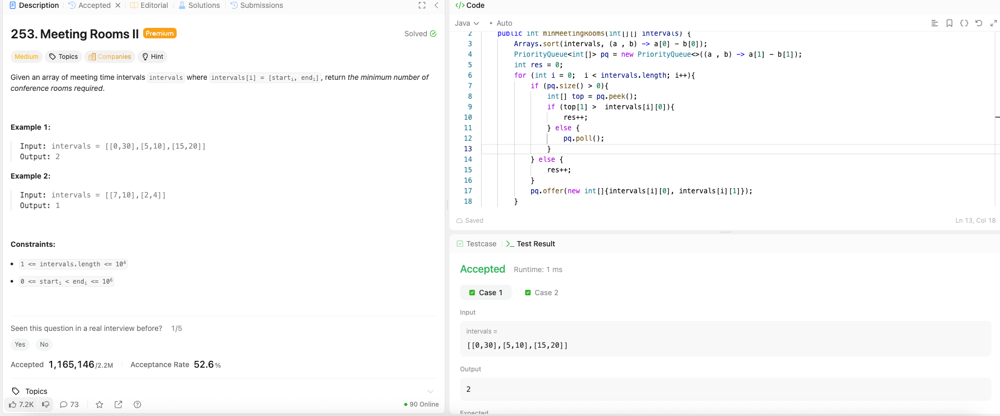

---

## 🧠 Meta

- **Problem ID:** 253
- **Difficulty:** Medium
- **Category:** Priority queue
- **Date Solved:** 2026-04-09
- **Time Spent:** ~40 minutes
- **Solved By Myself:** ❌
- **Revisit Needed:** Yes

---

## 🚧 Where I Got Stuck

- What confused me? I thought of the greedy problem for overlapping intervals. but this aint the same problem. consider [1,3], [2,4], [3.1,5] these can be merged to one interval but only two rooms are needed, not three rooms.
- What wrong approach did I try first?
- What assumption was incorrect?

---

## 💡 Key Insight

- Remember to start with sorting the list based on start time. it would be easier if we plan from the earliest meeting.
- Use a priority queue to keep track of the meeting that end the earliest. if the current start time is less than the end time of the top of priority queue, then we need to get a new room. otherwise, we update the latest end time of that room by poll the top and append the current time interval.
- we can do that because we don't care which room the current interval got assigned to. We only care about the number of the room.
