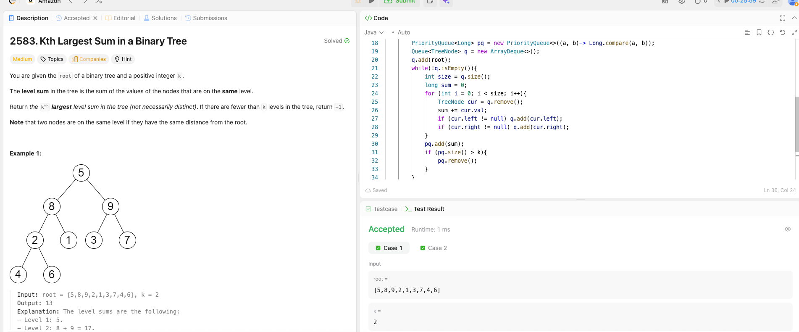

---

## 🧠 Meta

- **Problem ID:** 2583
- **Difficulty:** Medium
- **Category:** Tree / priority queue
- **Date Solved:** 2026-04-13
- **Time Spent:** ~24 minutes
- **Solved By Myself:** ⚠️ partial
- **Revisit Needed:** Yes

---

## 🚧 Where I Got Stuck

- What confused me?
- What wrong approach did I try first? i mistakenly mix the queue for the treeNode and priorityQueue for the sum.
  I also forgot to use Long instead of int for big number
- What assumption was incorrect?

---

## 💡 Key Insight

The one idea or mental model that unlocked the solution.

- i want to note the importance of using minHeap instead of maxHeap for this problem
  my first attempt used the maxHeap and add every sum to the priorityQueue, and then removed for k time. This could have a maxHeap of N size, so adding and deleting can be O(logN) time. In total it's O((N+k) logN)
- But if we use minHeap and keep the heap size at k. Whenever the size is about to exceed k, we remove, which remove the smallest value. and therefore at the end if there's k element remains in the minHeap, peek will give the kth largest number. the heap size is at most k so O(N logk) much faster
