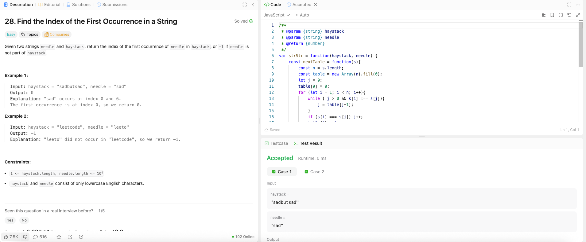

---

## 🧠 Meta

- **Problem ID:** 28
- **Difficulty:** Easy
- **Category:** KMP
- **Date Solved:** 2026-03-06
- **Time Spent:** ~60 minutes
- **Solved By Myself:** ❌
- **Revisit Needed:** Yes

---

## 🚧 Where I Got Stuck

- What confused me?
- What wrong approach did I try first?
- What assumption was incorrect?

---

## 💡 Key Insight

- KMP method is not easy to remember. These things take time.
- I remembered the concept of the nextTable is finding the length of longest same prefix and postfix of a string. I should remember the nextTable is built with the needle, that is, the string we want to find.
- Once the part for building nextTable is nailed, the part for using the nextTable for solving the problem is almost the same.
- Two pointers, j pointing to the end of the prefix, i to the end of the postfix. For loop iteration on i, starting on 1. j will backtrack until it's either 0 or needle[j] === needle[i], and if needle[j] === needle[i] then j++ (because j is the length of the prefix)and we record the new j to the nextTable
