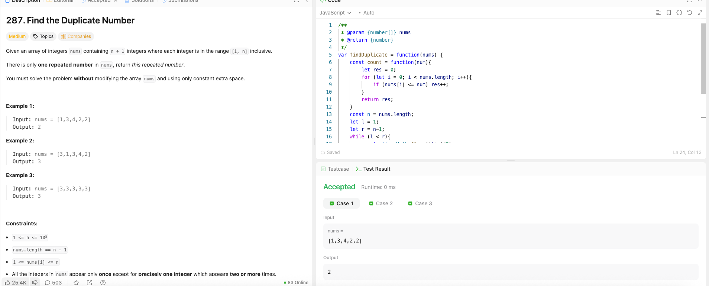

---

## 🧠 Meta

- **Problem ID:** 287
- **Difficulty:** Medium
- **Category:** Binary search / Cycle detection
- **Date Solved:** 2026-03-1
- **Time Spent:** ~26 minutes
- **Solved By Myself:** ❌
- **Revisit Needed:** Yes

---

## 🚧 Where I Got Stuck

- What confused me?
- What wrong approach did I try first? Thought of xor, but that's for finding the only unique element where other elements appear twice
- What assumption was incorrect?

---

## 💡 Key Insight

- Pay attention to the range of the numbers (although some of the numbers may not appear at all). If a number is not duplicate, the count of the number less than or equal to itself should be less than the number itself.
- On the other hand, a duplicate number will have the count of numbers less than or equal to itself greater than the number itself. The duplicate number and any number greater than the duplicate number will have the statement holds true. So it's a binary search for finding the first T
- pay attention to the direction where the binary search is going to. we should approach the first true, so it FFFFTTTTT. So it's if (true) right = mid
