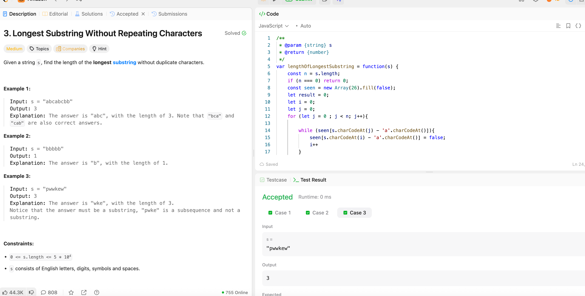

---

## 🧠 Meta

- **Problem ID:** 3
- **Difficulty:** Medium
- **Category:** sliding window
- **Date Solved:** 2026-02-06
- **Time Spent:** ~XX minutes
- **Solved By Myself:** ⚠️ partial
- **Revisit Needed:** Yes

---

## 🚧 Where I Got Stuck

- What confused me?
- What wrong approach did I try first?
- What assumption was incorrect?

---

## 💡 Key Insight

The one idea or mental model that unlocked the solution.
I tried iteration on left pointer first, ended up getting answer right but it's prone to error, and for that I has to initiate my right boundary as -1.
Need to remember the more intuitive way is to iterate on right boundary and shrink the left boundary as needed. Keep left boundary in place.
