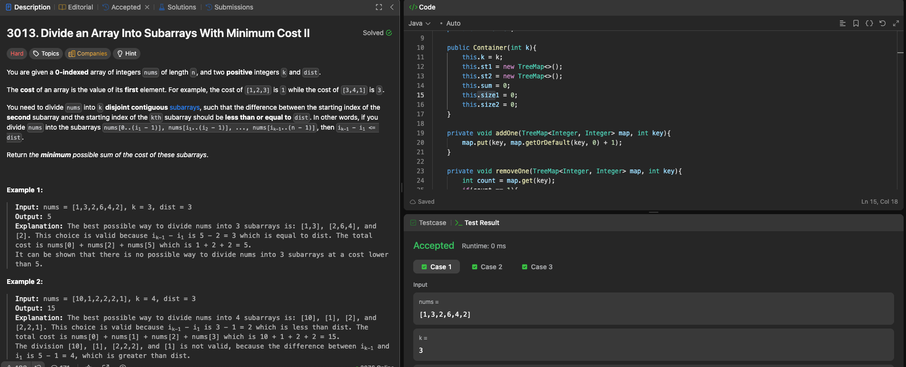

# LeetCode 3013. Divide an Array Into Subarrays With Minimum Cost II

---

## 🧠 Meta

- **Problem ID:** 3013
- **Difficulty:** Hard
- **Category:** sliding window / TreeMap
- **Date Solved:** 2026-02-02
- **Time Spent:** ~XX minutes
- **Solved By Myself:** ❌
- **Revisit Needed:** Yes

---

## 🚧 Where I Got Stuck

- What confused me? I got stuck at how to maintaining the sliding window, and what the window size should be
- What wrong approach did I try first? Try using priority heap, and realized that wont give me O(logn) time for getting biggest value in a minHeap
- What assumption was incorrect? The window size is not k-2, it's growing into dist

---

## 💡 Key Insight

This problem is too crazy. Even look at the solution I had a hard time writing it.
The use of st1 and st2 to represent the picked k-2 candidates, and unpicked number inside the window. I need helper functions to do add and remove operations. I need to keep the count of number in st1 to be k -2 always if there's enough numbers in the sliding window.
keep track of the size using a map, which has the frequency of each number
keep track of sum.
keeping track can be done with a class and private variables and public methods.
