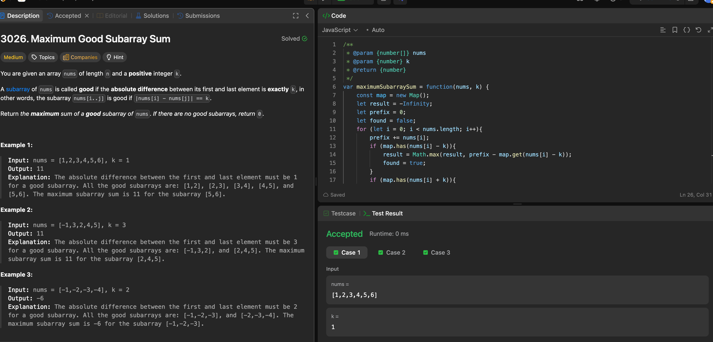

---

## 🧠 Meta

- **Problem ID:** 3026
- **Difficulty:** Medium
- **Category:** Prefix table
- **Date Solved:** 2026-05-06
- **Time Spent:** ~30 minutes
- **Solved By Myself:** ❌
- **Revisit Needed:** Yes

---

## 🚧 Where I Got Stuck

- What confused me? thought of prefix table, but checking each subarray will be O(n^2), then I checked the hints, it said use the number at index i as key for prefix table, and prefix sum ending at nums[i-1] as the value, then I got confused about the case of duplicate numbers.
- What wrong approach did I try first?
- What assumption was incorrect?

---

## 💡 Key Insight

- Solve it in one for loop, instead of getting the complete prefix, and then doing another for loop for every subarrays. We keep track of the accumulative prefix as we move in the for loop.
- As we move the pointer i in the array, i is pointing at the end of the subarray, so we just check if we have encounter the start of a potential good subarray before by looking for nums[i] +- k. Because we are doing one for loop, so we won't be dealing with number after nums[i];
- For the case of duplicate, we don't care where duplicate appears, as long as we update the prefix table to be the smaller prefix every time we run to a duplicate, because this make the (end prefix - start prefix without start) bigger.
- when updating the prefix map, remember to set the value as prefix excluding current, because this value will be used later for subtracting.
