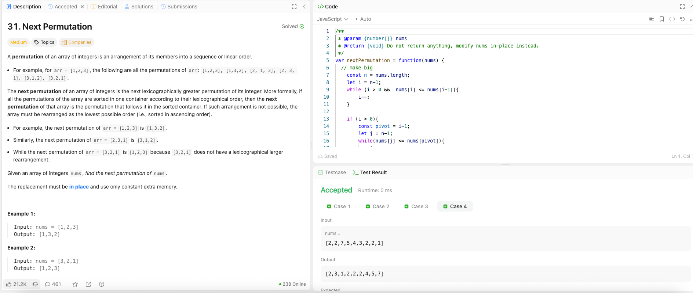

---

## 🧠 Meta

- **Problem ID:** 31
- **Difficulty:** Medium
- **Category:** Two pointers / Greedy
- **Date Solved:** 2026-03-09
- **Time Spent:** ~80 minutes
- **Solved By Myself:** ❌
- **Revisit Needed:** Yes

---

## 🚧 Where I Got Stuck

- What confused me?
- What wrong approach did I try first? I set the pivot for switching to the first digit to the left that is smaller than the rightmost digit( if there's no such pivot, shift one to the left from the rightmost and try to find the pivot etc.). But this won't guarantee the correctness. Think about it!
- What assumption was incorrect?

---

## 💡 Key Insight

- The idea is to make it big, but not too big. Just enough
- so from right to left, we find the pivot i such that nums[i] < nums[i+1] , and then find the smallest element that is bigger than pivot, to the right of pivot. This can be done by scanning from right end to the left and find the first element bigger than pivot. Because to the right of the pivot is a decreasing sequence.
- We switch the value of the pivot and that smallest bigger number. This makes the array lexically bigger.
- Then we sort the array to the right of pivot in increasing order so it's lexically smaller. This can be done with two pointers efficiently!
- If we can't find the pivot, which means array is lexically largest, then we just reverse the array with two pointers so it's lexically smallest.
