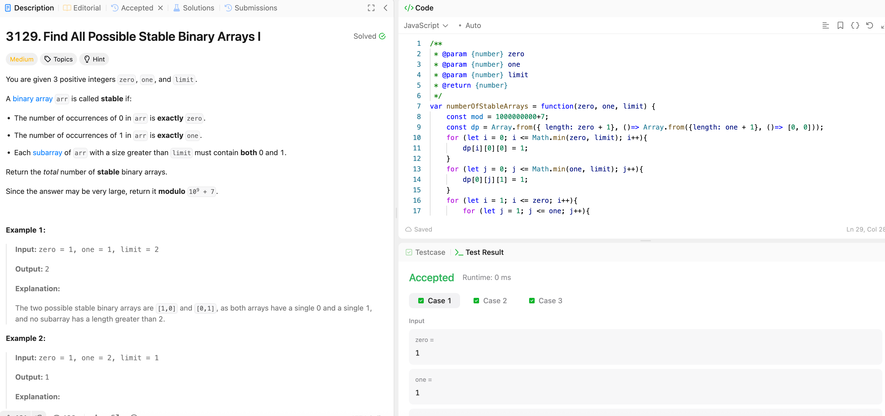

---

## 🧠 Meta

- **Problem ID:** 3129
- **Difficulty:** Medium
- **Category:** DP
- **Date Solved:** 2026-03-09
- **Time Spent:** ~120 minutes
- **Solved By Myself:** ❌
- **Revisit Needed:** Yes

---

## 🚧 Where I Got Stuck

- What confused me? I was clueless, knew is dp but don't how the transition happen
- What wrong approach did I try first?
- What assumption was incorrect?

---

## 💡 Key Insight

Think about only appending the number to the end of the string when making the transition.
