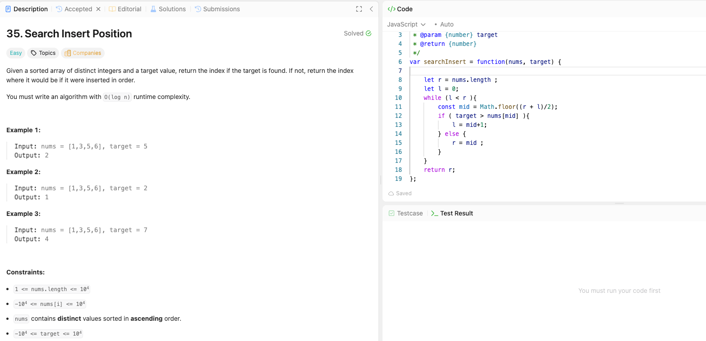

---

## 🧠 Meta

- **Problem ID:** 35
- **Difficulty:** Easy
- **Category:** binary search
- **Date Solved:** 2026-04-12
- **Time Spent:** ~44 minutes
- **Solved By Myself:** ⚠️ partial
- **Revisit Needed:** Yes

---

## 🚧 Where I Got Stuck

- What confused me?
- What wrong approach did I try first? I spend too much effort on the edge cases, and my condition for finding the index is fragile. I also fucked up getting the mid. i put (r-l)/2 at first. Also the r should start from n since you can insert at the last place
- What assumption was incorrect?

---

## 💡 Key Insight

- I stuck at either infinite loop or wrong index at first trial
- the problem can be solved in many ways in term of binary search, but it's most obvious in finding the first True such that nums[mid] >= target
  therefore we can if (nums[mid] >= target) r = mid else l = mid + 1 for mid = Math.floor((l+r)/2)
