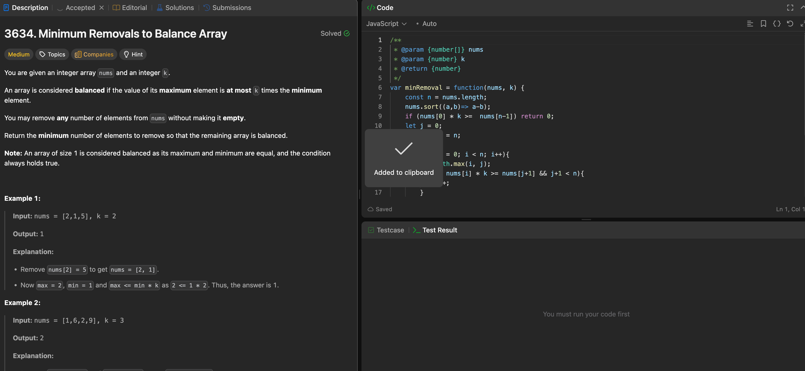

---

## 🧠 Meta

- **Problem ID:** 3634
- **Difficulty:** Medium
- **Category:** sliding window
- **Date Solved:** 2026-02-06
- **Time Spent:** 13 minutes
- **Solved By Myself:** ⚠️ partial
- **Revisit Needed:** Yes

---

## 🚧 Where I Got Stuck

- What confused me?
- What wrong approach did I try first? I try two pointers, first while loop always change left pointers and second while loop always change right pointers and take the min of their results. but it aint right because the solution can be taking off some of the left and some of the right.
- What assumption was incorrect?

---

## 💡 Key Insight

use Sliding window, loop through i as starting point, and keep the ending point j as Math.max(i,j) in each for iteration.

- check while( nums[i] _ k >= nums[j+1] && j+1 < n){
  j++;
  }
  instead of while( nums[i] _ k >= nums[j] && j < n){
  j++;
  }
  beacause we only want j to be the ending point of a valid window. It saves so much trouble this way!
