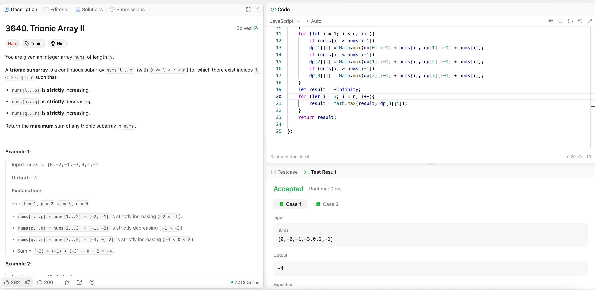

---

## 🧠 Meta

- **Problem ID:** 3640
- **Difficulty:** Hard
- **Category:** DP
- **Date Solved:** 2026-02-04
- **Time Spent:** ~XX minutes
- **Solved By Myself:** ⚠️ partial
- **Revisit Needed:** Yes

---

## 🚧 Where I Got Stuck

- What confused me? I thought about computing prefix sum, and then check all possible trionic arrays, but that will gives me O(n^2)
- What wrong approach did I try first?
- What assumption was incorrect?

---

## 💡 Key Insight

I looked at the hints and it helps. gotta use DP, split the trionic array into four stages: start -> increase -> decrease -> increase, then it's easy
DP is hard to come up by my own. dp[i][j] means the max of the sum of subarray ending it j after the i th stages
