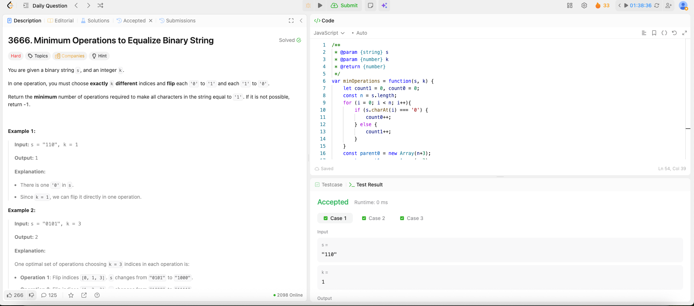

---

## 🧠 Meta

- **Problem ID:** 3666
- **Difficulty:** Hard
- **Category:** BFS / Disjoint Set
- **Date Solved:** 2026-02-27
- **Time Spent:** ~98 minutes
- **Solved By Myself:** ❌
- **Revisit Needed:** Yes

---

## 🚧 Where I Got Stuck

- What confused me?
- What wrong approach did I try first? I tried greedy method with a little bit of math.
- What assumption was incorrect? I realized it cannot be solved with greedy, where I flipped as many 0 to 1 as possible. Sometimes you need to intention flip more 1 to 0.

---

## 💡 Key Insight

Checked the solution. The Math is easy. It's a BFS problem for finding the shortest steps. But the simple BFS gpt TLE

- The BFS's target on each node is within the range for next possible value
- Use two order sets and use the parity (even/ odd) to filter out some unnecessary search: parent1, parent2. This can be easier done in java with TreeSet
- Because I wrote in js I need to use Disjoint Set to track if a node has been visited. If it's been visited, it's parent will not be itself. The parent is the next possible number ( can possibly also be visited).
- The way we made a number visited is to set it's parent to the next number, which is find(parent,x + 2). So we have x !== parent[x], which means visited. As for why specific x + 2, because it's the next candidate.
