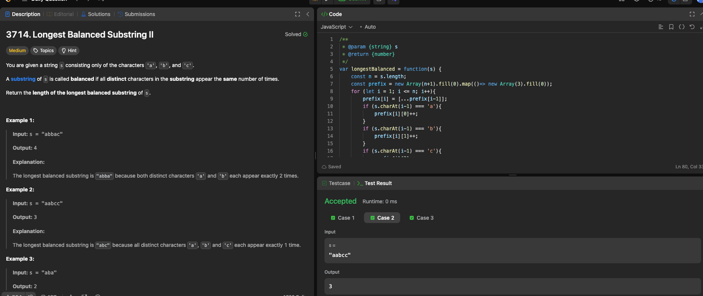

---

## 🧠 Meta

- **Problem ID:** 3714
- **Difficulty:** Medium
- **Category:** Array / Prefix
- **Date Solved:** 2026-02-13
- **Time Spent:** ~XX minutes
- **Solved By Myself:** ❌
- **Revisit Needed:** Yes

---

## 🚧 Where I Got Stuck

- What confused me?
- What wrong approach did I try first? I tried brute force it and TLE
- What assumption was incorrect?
  s

---

## 💡 Key Insight

I followed the hints and it need three helpers functions for three cases: single character, pairs, and three characters
The key insight is we calculate the diff of frequency, and when the second time when we have the same diff, we know it's balanced
Be careful when finding the length, it should be i - the first appearance index(j) rather than i - j+ 1, a bit counterintuitive
Should be careful about the pairs, as we need to reset when encountering a character not in the pair.
should be careful about key assignment in js. array as a key doesn't work. Encode it as a string: diff1 + '#' + diff2
