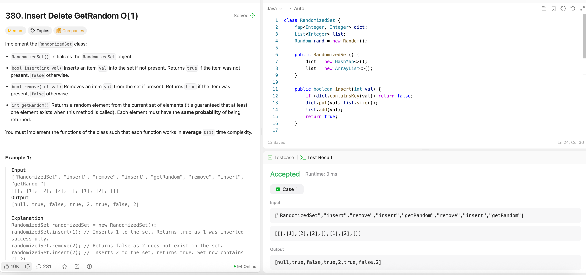

---

## 🧠 Meta

- **Problem ID:** 380
- **Difficulty:** Medium
- **Category:** HashMap / Class
- **Date Solved:** 2026-04-03
- **Time Spent:** ~30 minutes
- **Solved By Myself:** ❌
- **Revisit Needed:** Yes

---

## 🚧 Where I Got Stuck

- What confused me? I am scared of writing methods and class ngl
- What wrong approach did I try first?
- What assumption was incorrect?

---

## 💡 Key Insight

- I thought of the HashMap for insertion and deletion but got stuck at randomization
- It requires both map (element -> index) and an array of elements (index -> array)
- The deletion is a bit trick in constant time. To do this, switch the element at the end of the array with the element we want to delete, and pop the element at the end. Then we update the map (delete old value key, update the last element key to the new index)
- Java use Random interface Random rand = new Random and rand.nextInt(n) to get random number from 0 to n - 1
