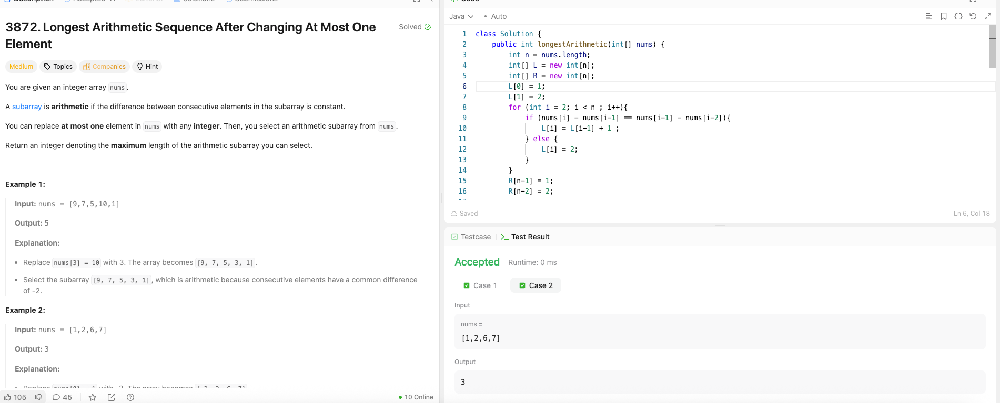

---

## 🧠 Meta

- **Problem ID:** 3872
- **Difficulty:** Medium
- **Category:** Array
- **Date Solved:** 2026-04-09
- **Time Spent:** ~XX minutes
- **Solved By Myself:** ❌
- **Revisit Needed:** Yes

---

## 🚧 Where I Got Stuck

- What confused me? thought it was a sliding window problem. because it can only change one number, i thought of explore all possibilities with backtracking
- What wrong approach did I try first?
- What assumption was incorrect?

---

## 💡 Key Insight

- Use prefix arrays. We can calculate L where L[i] is the max length of arithmetic subarray ending at i. This is not enough since we can change any i, so we need R where R[i] is the max length of arithmetic subarray starting at i
- remember except at 0 and n-1, the smallest possible value for L and R is 2.
- Be careful with edge cases, sometimes you only merge the changed value at i with the left hand side, sometimes right hand side. sometimes with both. And also need to include the the cases that we change the value at 0 and n-1
