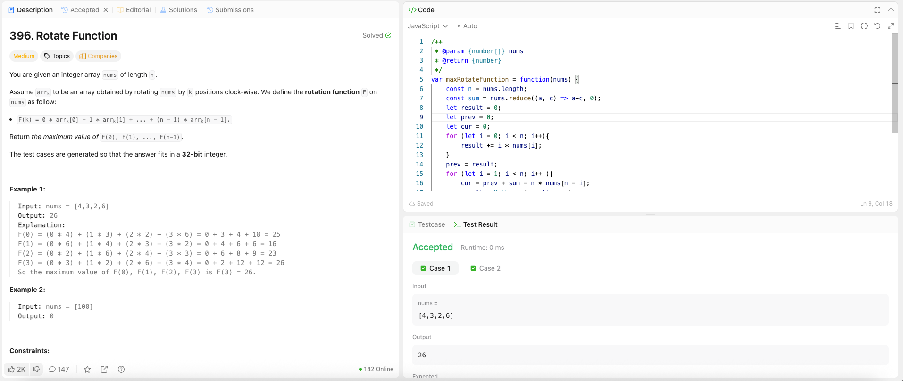

---

## 🧠 Meta

- **Problem ID:** 396
- **Difficulty:** Medium
- **Category:** DP
- **Date Solved:** 2026-05-07
- **Time Spent:** ~19 minutes
- **Solved By Myself:** ❌
- **Revisit Needed:** Yes

---

## 🚧 Where I Got Stuck

- What confused me? was thinknig of largest sum of circular subarray.
- What wrong approach did I try first?
- What assumption was incorrect?

---

## 💡 Key Insight

The one idea or mental model that unlocked the solution.

- Once found the pattern for DP, it's easy. More of a math formula problem
