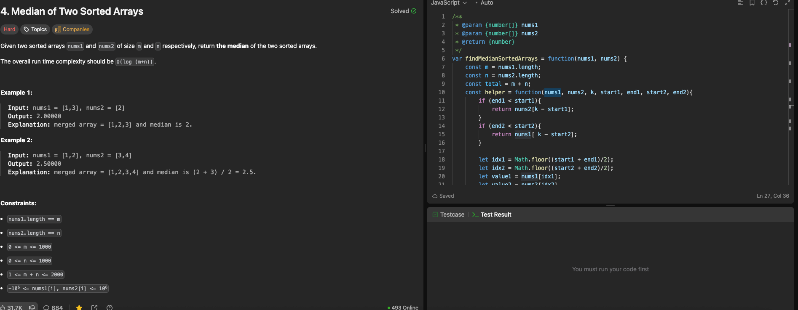

---

## 🧠 Meta

- **Problem ID:** 4
- **Difficulty:** Hard
- **Category:** binary search
- **Date Solved:** 2026-02-09
- **Time Spent:** ~XX minutes
- **Solved By Myself:** ❌
- **Revisit Needed:** Yes

---

## 🚧 Where I Got Stuck

- What confused me?
- What wrong approach did I try first?
- What assumption was incorrect?

---

## 💡 Key Insight

I cannot solve this without looking the solution. the O(logmn) method requires binary search of course. Two methods:

- binary search on both arrays: finding middle indices on both sorted arrays, idx1, idx2, then compare to k, which is the median index we want.
  Based on the result of the comparison, we could discard one side of an array. By recursion, we implement binary search
- The second method is an optimized method. We know we gonna reach k, so only do binary search on the shorter array. The longer one will have index of math.floor((m+n+1)/2) - idx1. The extra +1 is there to ensure median is included in the left section of the m+n array. We maintain four variables: maxLeft1, minRight1, from idx1, and maxLeft2, minRight2 from idx2. The design is intricate and requires care with boundary.

anyway this problem is hard as hell. I need to review it from time to time to understand the details.
