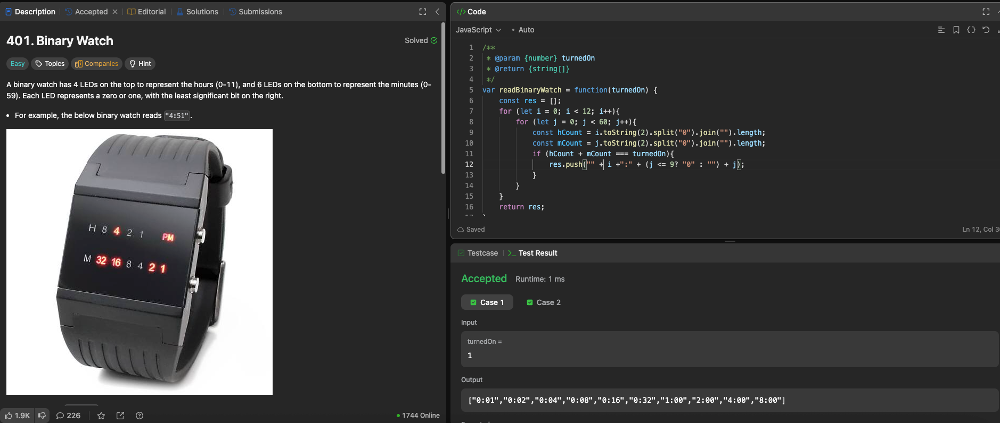

---

## 🧠 Meta

- **Problem ID:** 401
- **Difficulty:** Easy
- **Category:** Binary
- **Date Solved:** 2026-02-18
- **Time Spent:** ~XX minutes
- **Solved By Myself:** ❌
- **Revisit Needed:** Yes

---

## 🚧 Where I Got Stuck

- What confused me?
- What wrong approach did I try first?
- What assumption was incorrect?

---

## 💡 Key Insight

I didn't realize the minute and hour number can be represented in binary. The number of turned on lights is the number of ones in the binary string.

- we can either enumerate the time, or numerate on the number of binary: we have 10 lights in total so that's 2^10 = 1024, enumerate on this.
