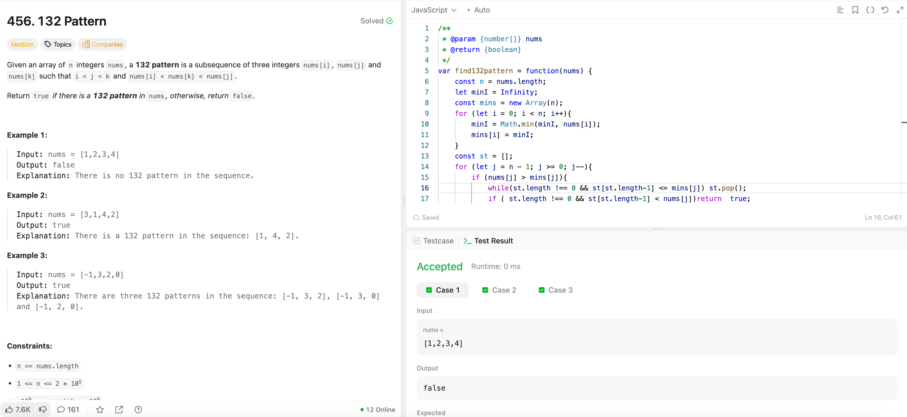

---

## 🧠 Meta

- **Problem ID:** 456
- **Difficulty:** Medium
- **Category:** stack / array
- **Date Solved:** 2026-03-31
- **Time Spent:** ~80 minutes
- **Solved By Myself:** ❌
- **Revisit Needed:** Yes

---

## 🚧 Where I Got Stuck

- What confused me? I tried the brute force and optimized brute force. O(n^3) and O(n^2) respectively.
- What wrong approach did I try first?
- What assumption was incorrect?

---

## 💡 Key Insight

- it's not technically a classic monotonic stack problem because we are comparing the top of the stack with mins and appending nums instead.

- the O(n) way is using stack together with prefix array for min in the left of j (including j)
- To construct array for candidates of k, it's a stack , while the top of the stack is not greater than mins[j], keep poping. and then if the stack is not empty and the top is less than nums[j], then it's a 132. After this we need to append the current nums[j] to the stack as a future candidate for some earlier index.
- the above code block happens only when we find a potential valid i , j pair, that is nums[j] > mins[j].
- it's not technically a classic monotonic stack problem because we are comparing the top of the stack with mins and appending nums instead.
