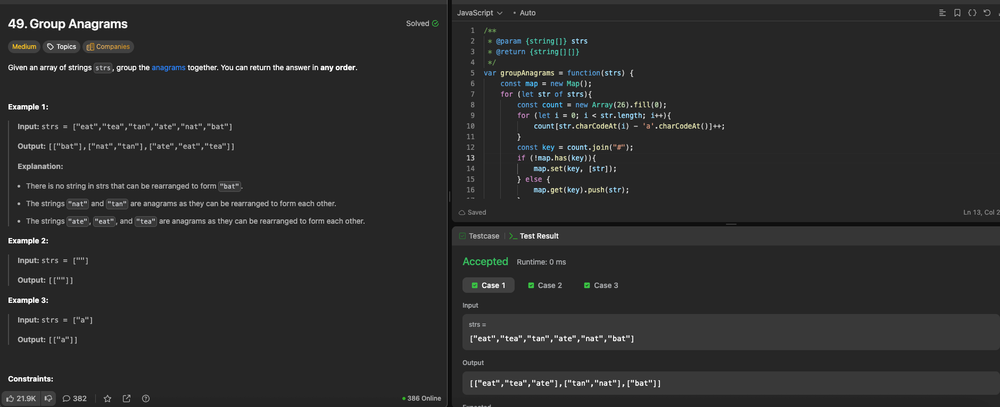

---

## 🧠 Meta

- **Problem ID:** 49
- **Difficulty:** Medium
- **Category:** Array / Map
- **Date Solved:** 2026-02-23
- **Time Spent:** ~19 minutes
- **Solved By Myself:** ⚠️ partial
- **Revisit Needed:** Yes

---

## 🚧 Where I Got Stuck

- What confused me?
- What wrong approach did I try first? I thought of using a 26 x n array to check all frequency of the char in each string first and compare each of them. Too slow and not bright
- What assumption was incorrect?

---

## 💡 Key Insight

- Use the frequency of each letter and delimiter # to form a string, and use the string as a key to the map, to group anagrams
- Be familiar with Java string builder, and new ArrayList(Map.values)
- js is simpler with the use of array join for string formation
