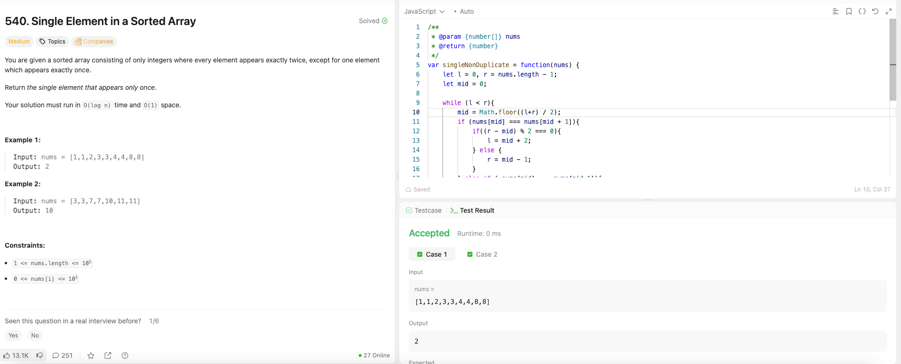

---

## 🧠 Meta

- **Problem ID:** 540
- **Difficulty:** Medium
- **Category:** Binary Search
- **Date Solved:** 2026-05-07
- **Time Spent:** ~20 minutes
- **Solved By Myself:** ❌
- **Revisit Needed:** Yes

---

## 🚧 Where I Got Stuck

- What confused me? Thought of binary search and even/odd, but my update of the left and right is not correct
- What wrong approach did I try first?
- What assumption was incorrect?

---

## 💡 Key Insight

The one idea or mental model that unlocked the solution.

- My examples when thinking of the problem was not comprehensive. Thought of only 2 cases instead of 4. if mid is not the single number, we removed the mid duplicate numbers, and if one side is even, then the single number is on the other side.
- be careful. in the case of left === right, answer is nums[left] instead of nums[mid]
