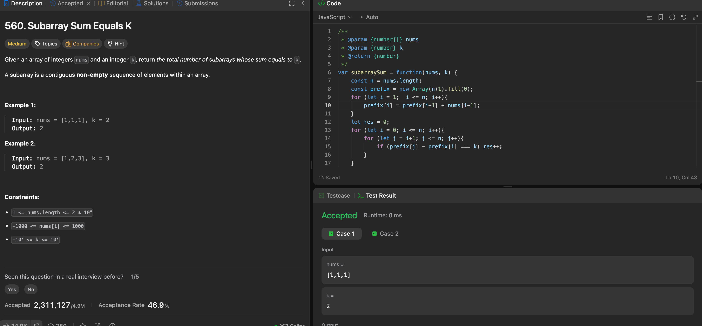

---

## 🧠 Meta

- **Problem ID:** 560
- **Difficulty:** Medium
- **Category:** HashMap / Prefix
- **Date Solved:** 2026-03-06
- **Time Spent:** ~12 minutes
- **Solved By Myself:** ✅
- **Revisit Needed:** Yes

---

## 🚧 Where I Got Stuck

- What confused me?
- What wrong approach did I try first?
- What assumption was incorrect?

---

## 💡 Key Insight

I solved the problem using prefix table in O(n^2) time. I wanted to take note because there's a O(n) method.

- use hashmap to document the number of occurrence of a prefix sum a. and check for the value of map[a - k]. res += map[a-k]. Then we do this in one for loop as we calculate the prefix. genius! Don't even need the array for the prefix table.
