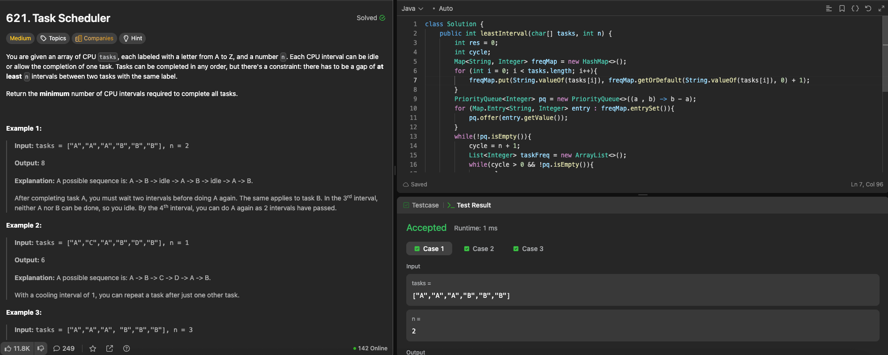

---

## 🧠 Meta

- **Problem ID:** 621
- **Difficulty:** Medium
- **Category:** Priority Queue
- **Date Solved:** 2026-04-09
- **Time Spent:** ~44 minutes
- **Solved By Myself:** ❌
- **Revisit Needed:** Yes

---

## 🚧 Where I Got Stuck

- What confused me? Thought of Priority Queue. But then I was stuck with updating the frequency on the pq. I thought the element in pq should be an array like ["A", 3]
- What wrong approach did I try first?
- What assumption was incorrect?

---

## 💡 Key Insight

- Need to understand the concept of a cycle. that is a interval of length n+1 where n is the limit
- pq can simply store integer, since we dont care the exact representation of the char, just the frequency
- do while loop on when pq is not empty, then inside the while loop, we iterate on one cycle
- poll elements until pq is empty, or when cycle is completed. The polled frequency is updated and stored in a temporary array, and we later add the updated frequencies back the pq.
- add length to the result time. If pq is still empty after we updated frequencies ( means running out of task, we reach the end), add the number of tasks in this cycle. otherwise we add n+1 (we can always form a complete cycle no matter what, by filling in idle )
- This feels like a brain teaser
