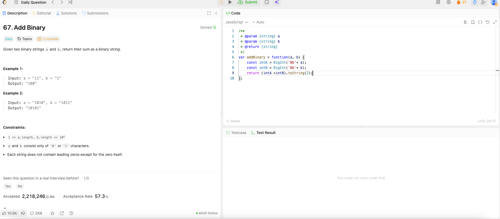

---

## 🧠 Meta

- **Problem ID:** 67
- **Difficulty:** Easy
- **Category:** Binary / String
- **Date Solved:** 2026-02-15
- **Time Spent:** ~XX minutes
- **Solved By Myself:** ❌
- **Revisit Needed:** Yes

---

## 🚧 Where I Got Stuck

- What confused me? I am very not familiar with binary operation and have no clues
- What wrong approach did I try first? After checking the js method for converting string of number to its binary, I used parseInt(a, 2) but it's not enough for big number
- What assumption was incorrect?

---

## 💡 Key Insight

The one idea or mental model that unlocked the solution.

- use BigInt('0b'+a) to convert the binary string of a number to actual number.
- convert the number to its binary string, use toString(num, 2)
- toString(num) convert the number to the actual string, not it's binary string.
- second argument in toString() and ParseInt() is radix, is for specifying the base, like 2 base, 12 base etc. 10 base for decimal.
