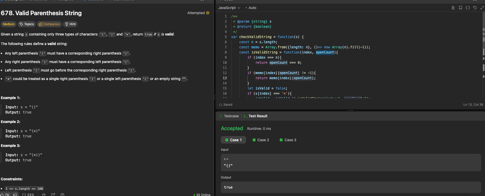

---

## 🧠 Meta

- **Problem ID:** 678
- **Difficulty:** Medium
- **Category:** DP / BackTracking / memory look up table
- **Date Solved:** 2026-03-31
- **Time Spent:** ~22 minutes
- **Solved By Myself:** ❌
- **Revisit Needed:** Yes

---

## 🚧 Where I Got Stuck

- What confused me? Thought of backtrack, but I was thinking keeping the path as normal backtracking.
- What wrong approach did I try first?
- What assumption was incorrect?

---

## 💡 Key Insight

- Use the DP for memorization so we don't get repetitive calculation. which could be 3^n
- DP[i][j] tracking if the string ends at i index and with j open bracket count is valid, it's value is from the recursive call (backtracking) from isValidString(i+1)
- don't need to explicitly write the condition for str[i] === "(" .ß It's in the else part and with another condition openCount > 0 . Since we initiate isValid to be false in each layer, then ( with openCount < 0 will just be invalid.
- it's not a normal DP problem where we look fro DP[n-1][n-1], we just use the DP table for memorization to keep it O(n^2)
