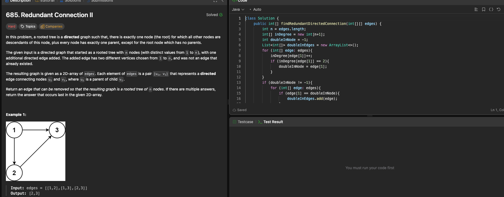

# LeetCode 685. Redundant Connection II

---

## 🧠 Meta

- **Problem ID:** 685
- **Difficulty:** Hard
- **Category:** Graph / Disjoint set
- **Date Solved:** 2026-02-01
- **Time Spent:** ~XX minutes
- **Solved By Myself:** ❌
- **Revisit Needed:** Yes

---

## 🚧 Where I Got Stuck

- What confused me? there are three cases when the redundant can happen. Need to break down to those three cases
- What wrong approach did I try first?
- What assumption was incorrect?

---

## 💡 Key Insight

calculate the in degree of each node
break down to three cases and write code to find the edge for each case. And because if multiple edges can be removed, we want the last edge, so need to be careful on the if condition when there's a node with 2 in-degree, if (isGraph without edge(the last candidate)) then return last candidate edge, else return the other one
