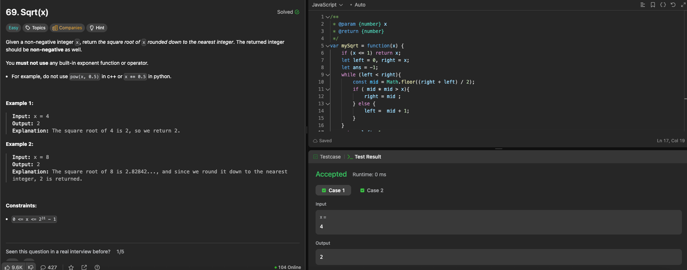

---

## 🧠 Meta

- **Problem ID:** 69
- **Difficulty:** Easy
- **Category:** Binary search
- **Date Solved:** 2026-02-19
- **Time Spent:** ~28 minutes
- **Solved By Myself:** ⚠️ partial
- **Revisit Needed:** Yes

---

## 🚧 Where I Got Stuck

- What confused me?
- What wrong approach did I try first?
- What assumption was incorrect?

---

## 💡 Key Insight

- Need to be familiar with when to use <= and when to use <. This is a boundary problem searching for the last m such that m \* m <= target so use <, and need to pay attention to biased picking.
- Before this question, I thought choose mid = Math.floor(l+r/2) and mid = Math.floor(l+r+1/2) is just a matter of right = mid or left = mid respectively. But it also change the variable we used to return at the end. For this problem for example, if we use the condition if (mid \* mid > target) right = mid, we are checking the bad, so at the end we return the last good, which is left -1;
- It will be easier if we check for if (mid \* mid <= target) left = mid = Math.floor(l +r +1/2); We check for good (T) here and return left at the end.
